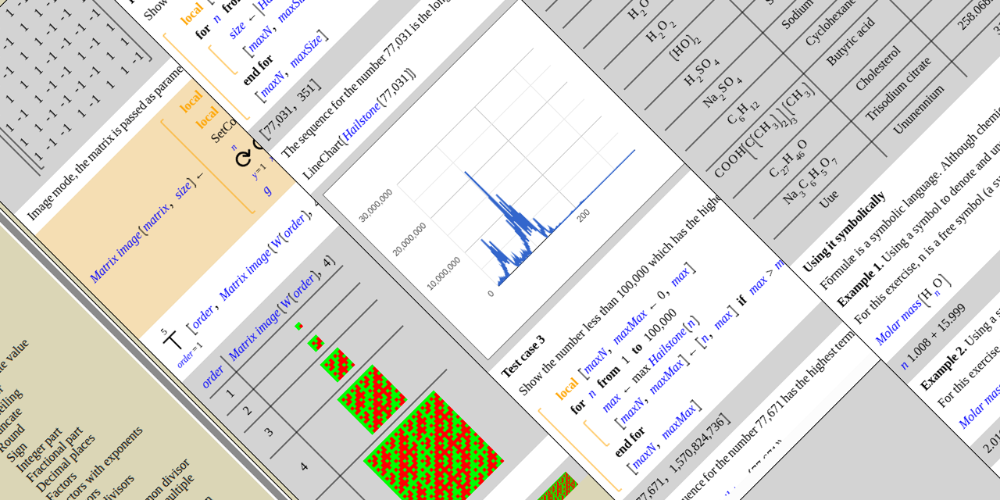

# Fōrmulæ

**A visual, web-based programming language and interactive notebook.**

Fōrmulæ lets you build and evaluate tree-structured expressions through a
visual editor — no text syntax to learn. Expressions are rendered as
mathematical-style notation on an HTML canvas, and evaluation happens live
in the browser.

🌐 **Try it now at [formulae.org](https://formulae.org)**

## What makes it different

- **Visual, not textual.** Expressions are trees you assemble visually,
  not lines of code you type.
- **Mathematical notation first.** The display closely follows standard
  mathematical and scientific conventions.
- **Notebook style.** The REPL is a sequence of rows: each input expression
  is followed immediately by its evaluated output.
- **No install, no dependencies.** Runs entirely in the browser. Vanilla
  JavaScript — no bundler, no npm, no build step.
- **Modular.** Functionality is organized into independent packages covering
  arithmetic, symbolic algebra, logic, lists, programming, plotting,
  matrices, typesetting, chemistry, cryptography, and more.

## Repositories

| Repository | Description |
|---|---|
| [formulae-js](https://github.com/formulae-org/formulae-js) | Core web application — engine, canvas renderer, REPL |
| [web-content](https://github.com/formulae-org/web-content) | Official tutorials, articles and examples (`.formulae` files) |
| `package-*-js` | One repository per package (see full list below) |

### Packages

Each package lives in its own repository named `package-{name}-js`:

`math-arithmetic` · `symbolic` · `logic` · `list` · `matrix` · `plot` ·
`programming` · `typesetting` · `chart` · `internet` · `chemistry` ·
`cryptography` · `data` · `time` · `color` · and more.

## Getting started

The easiest way to use Fōrmulæ is at [formulae.org](https://formulae.org)
— nothing to install.

<!--
To run it locally, clone [formulae-js](https://github.com/formulae-org/formulae-js)
and serve the `src/` directory with any static HTTP server.
-->

## Contributing

Contributions are welcome — bug reports, new packages, translations, and
content (tutorials, articles). Please open an issue or pull request in the
relevant repository.

For questions or general contact: **contact@formulae.org**

## License

All repositories are released under the
[GNU Affero General Public License v3.0](https://www.gnu.org/licenses/agpl-3.0.html).
